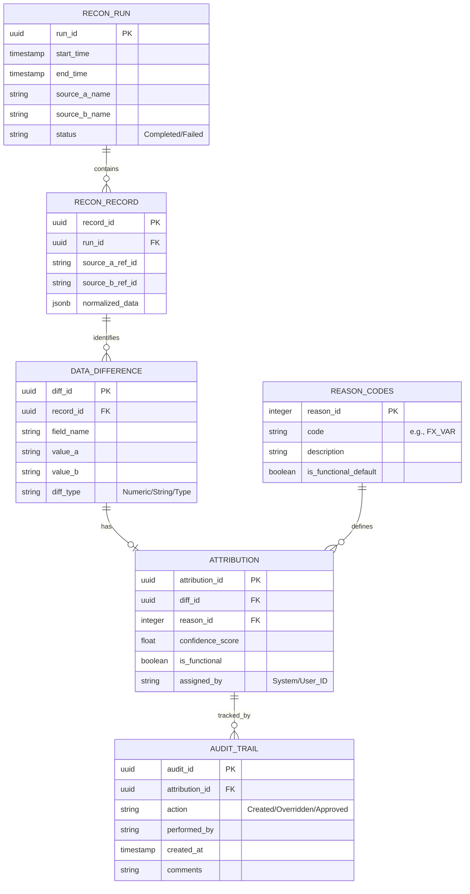

This file focuses on the Database Schema required to store the reconciliation results in 3rd Normal Form (3NF). This structure is designed to be highly performant, queryable for trend analysis, and audit-compliant.

Purpose: Defines the relational structure for storing source data, differences, attributions, and the audit trail for human interventions.

# 5. Database Entity Relationship Diagram (3NF)

This schema ensures data integrity while supporting high-speed queries for "Known" vs "Unknown" trends.



## Explanation of Tables
- **RECON_RUN**: Captures metadata about each reconciliation execution, including source names and timestamps.
- **RECON_RECORD**: Stores normalized records from both sources for comparison.
- **DATA_DIFFERENCE**: Logs specific differences found between the two sources for each record
- **ATTRIBUTION**: Records the attribution of differences to specific reasons, along with confidence scores and whether they are functional.
- **REASON_CODES**: A lookup table defining possible reasons for differences, including default functional
- **AUDIT_TRAIL**: Maintains a history of all actions taken on attributions for audit purposes.

This schema is designed to facilitate efficient querying for trend analysis, allowing users to quickly identify patterns in "Known" vs "Unknown" differences while ensuring that all human interventions are fully auditable.
``````

### Implementation Notes for this Schema:
* **Performance:** In a production environment, `RECON_RECORD` and `DATA_DIFFERENCE` should be partitioned by `run_id` or `timestamp` to ensure that queries remain fast even as the database grows into the millions of rows.
* **JSONB Usage:** While the schema is 3NF, the `normalized_data` field in `RECON_RECORD` uses a JSONB/Document type to allow for flexibility if different reconciliation runs have slightly different metadata.
* **Auditability:** The `AUDIT_TRAIL` table is the "Single Source of Truth" for the 4/6-eye check, tracking exactly who changed an "UNKNOWN" to a "KNOWN" reason and who authorized it.
---

### Services ↔ Tables (mapping)


Notes:
-  and reconciliation services create , , and .
-  and background workers write  and  and enqueue corrections for training.
-  reads and writes  and  when users perform overrides via the UI.

**Component → File mapping**
- : backend/diff_engine.py
- : backend/attribution_engine.py
- : backend/ingest_engine.py
-  API: bff/main.py and bff/routers/
- : frontend/src/
- : database/schema/*.sql


**Component → File mapping**
- `diff_engine.py`: backend/diff_engine.py
- `attribution_engine.py`: backend/attribution_engine.py
- `ingest_engine.py`: backend/ingest_engine.py
- `BFF` API: bff/main.py and bff/routers/
- `Frontend`: frontend/src/
- `DB schema`: database/schema/*.sql
